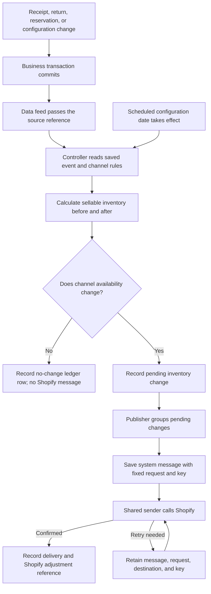

HotWax Commerce now records the changes behind Shopify inventory updates in a durable event ledger. Retailers can follow a receipt, return, or reservation from its source through the quantity calculation and the message sent to Shopify. If delivery needs a retry, HotWax keeps the original publishing decision attached to that message.

Inventory movement and online availability are not always the same thing. A receipt might replenish stock held back for store shoppers without making another unit available online. The new flow separates what happened in the order management system (OMS) from how much Shopify should change.

## Record the event once

The supporting data feed passes a source reference after the business transaction commits. The event controller reads the saved receipt, inventory detail, or configuration change instead of accepting a quantity calculated by the caller.

Each ledger row identifies the event type, source reference, inventory channel, and Shopify inventory item. An inventory channel connects a group of facilities to a Shopify inventory location. A purchase receipt, transfer receipt, return restock, or reservation remains distinguishable within the same flow.

That combination also prevents the same source event from creating another adjustment for the same channel and inventory item when the feed is replayed. Configuration changes with a future start or end date enter the calculation when that date takes effect.

## Publish the sellable change, not every movement

HotWax calculates available-to-promise (ATP) inventory, the quantity available to sell after reservations, before and after the event. It reconstructs the affected facility's quantities from the saved inventory details, applies its minimum stock and order-routing eligibility, and combines the eligible facilities in the channel. Facilities not changed by the event contribute their stored sellable inventory counts. The channel calculation then applies channel-level safety stock and, when inventory reservation is enabled, deducts open order demand still in virtual queues. The calculated channel availability cannot fall below zero.

For example, a store holds back five units of a product for store shoppers. Its ATP quantity is four, so its online contribution is zero: `max(0, 4 - 5) = 0`. Receiving one more unit raises ATP to five, but the online contribution remains zero: `max(0, 5 - 5) = 0`. With the other channel quantities and rules unchanged, that receipt has no effect on Shopify availability. HotWax records a no-change decision and sends no adjustment.

A later receipt of two units raises the same store's ATP from five to seven. The store's online contribution rises from zero to two. With no other channel deduction, HotWax records a change of two, not the store's full inventory quantity. A facility excluded from order routing can likewise receive inventory without adding stock to that channel's online availability.

## Follow the event through to Shopify

The ledger keeps quantity calculation separate from delivery. A publisher groups pending changes by inventory channel, inventory item, and event type by default. This keeps one item's failure from blocking unrelated items and preserves the reason for the adjustment.

For a Shopify connection with real-time inventory push enabled, the flow looks like this:

The publishing job can drain a channel's pending queue into saved messages. Old ledger rows become eligible for cleanup only after their work reaches a terminal state and the retention period passes. An absolute inventory reset can supersede unbatched changes when HotWax needs to reassert the authoritative quantity. Messages already saved for delivery retain their original assignment and request.

## Retry the same Shopify adjustment without adding it twice

There are two separate protections. The ledger key prevents HotWax from recording a source event twice. A Shopify idempotency key prevents a retry of the resulting outbound message from applying its inventory adjustment again.

HotWax reserves a system message ID when it builds a batch. It saves that ID as the `idempotencyKey` passed to Shopify's `inventoryAdjustQuantities` mutation through the `@idempotent` directive. The request, destination connection, and key stay fixed. A retry sends the saved message rather than generating a new key or recalculating its quantities.

For example, Shopify might apply an adjustment of two units before the connection drops and HotWax receives the response. Retrying that message with the same key and parameters lets Shopify recognize the earlier operation instead of adding two more units. A separate receipt creates a separate message and key, even if its quantity happens to be identical.

[Shopify's idempotency guide](https://shopify.dev/docs/apps/build/apis/graphql-admin/implementing-idempotency) documents a 24-hour recognition window. Within that window, a retry of a successful request returns the stored result without repeating the operation. A retry after 24 hours is not protected by that key. The August release calls Shopify API version `2026-01`, which supports the directive. System message IDs are unique within one OMS instance; separate instances sharing a Shopify shop must not reuse a key for different adjustments.

## Monitor the flow from Company

The `Inventory Sync` workspace in Company shows waiting events, batches, jobs, recent reset runs, and event history for each Shopify connection. Teams can see whether inventory is waiting to be batched, in flight, failed, or delivered, then follow the message back to the source events behind it.

Company also exposes whether the supporting data feeds run in manual or real-time mode. Because this setting applies across the OMS, the interface presents it as an operational control rather than a preference for one individual user.

The result is a publishing flow that answers what changed sellable inventory, what HotWax sent, and which saved message needs attention when delivery fails.

*Sources: [mantle-shopify-connector#477](https://github.com/hotwax/mantle-shopify-connector/pull/477), [mantle-shopify-connector#558](https://github.com/hotwax/mantle-shopify-connector/pull/558), [mantle-shopify-connector#559](https://github.com/hotwax/mantle-shopify-connector/pull/559), [mantle-shopify-connector#560](https://github.com/hotwax/mantle-shopify-connector/pull/560), [mantle-shopify-connector#561](https://github.com/hotwax/mantle-shopify-connector/pull/561), [company#352](https://github.com/hotwax/company/pull/352), [mantle-shopify-connector v4.1.2](https://github.com/hotwax/mantle-shopify-connector/releases/tag/v4.1.2), [company v2.2.1](https://github.com/hotwax/company/releases/tag/v2.2.1)*
